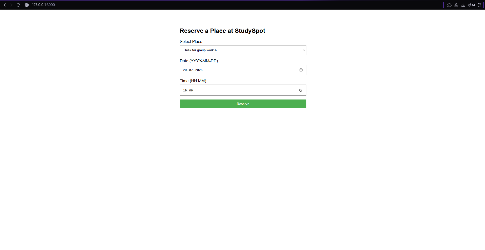
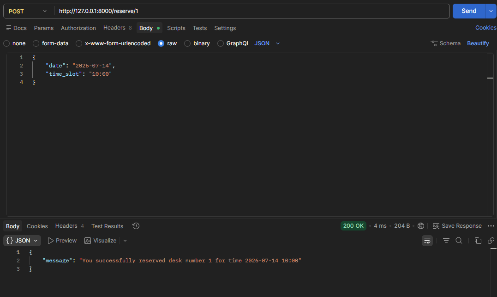
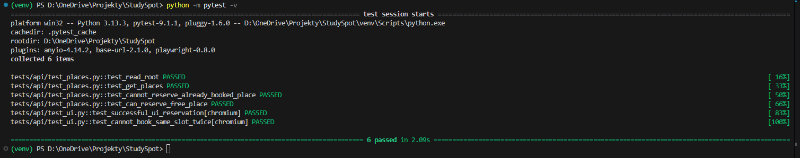
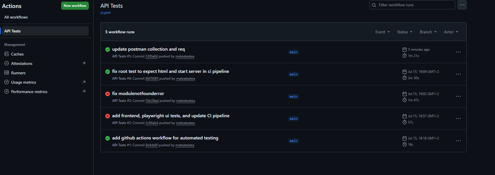
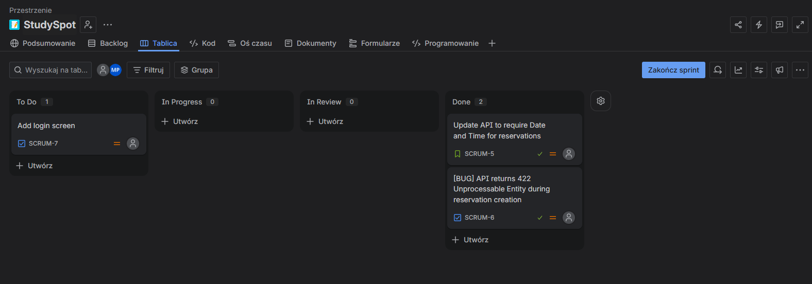

# 🎓 StudySpot - QA Automation Portfolio Project

A full-stack seat reservation system built specifically to demonstrate modern Quality Assurance, API testing, and CI/CD automation skills. 

This project simulates a real-world application with a backend API, a frontend interface, and a complete testing pyramid ranging from manual Postman exploration to automated Playwright UI tests.

## 🛠️ Tech Stack & Tools Used
*   **Backend:** Python 3.10, FastAPI, Pydantic
*   **Frontend:** HTML, JavaScript
*   **Manual API Testing:** Postman
*   **Automated API Testing:** Pytest
*   **End-to-End (E2E) UI Testing:** Playwright (Python)
*   **CI/CD Pipeline:** GitHub Actions
*   **Project Management:** Jira (Agile/Scrum workflow)

---

## 📸 Project Gallery

### 1. Web Interface (Frontend)
*(Shows the functioning HTML UI successfully communicating with the backend API).*


### 2. Manual API Testing (Postman)
*(Exploratory testing and endpoint verification for payload structures and status codes).*


### 3. Automated API & E2E Testing (Pytest + Playwright)
*(Passing test suite verifying core logic, negative paths, and browser automation).*


### 4. Continuous Integration (GitHub Actions)
*(Cloud-based CI/CD pipeline that automatically builds the app and runs all tests on every push).*


### 5. Agile Workflow (Jira)
*(Professional bug reporting and task tracking using a Kanban board).*


---

## 🎯 QA & Testing Strategy

This project implements the **Testing Pyramid** approach:

1.  **Manual Exploratory Testing (Postman):** Used for initial endpoint verification, debugging, and documenting the API payload structures.
2.  **Automated API Tests (Pytest):** Fast, reliable tests that verify the core logic, status codes (200 OK, 400 Bad Request, 422 Unprocessable Entity), and business rules (e.g., blocking double bookings).
3.  **UI Automation (Playwright):** Simulates real user behavior in the browser, filling out forms and interacting with the DOM to ensure the frontend correctly communicates with the backend.
4.  **Continuous Integration (GitHub Actions):** Every `git push` triggers a cloud-based Ubuntu server that boots the app, installs browsers, and runs the entire test suite automatically to prevent regressions.

## 🚀 How to Run the Project Locally

### 1. Setup the Environment
Clone the repository and install the required dependencies:
```bash
git clone https://github.com/mateateatea/StudySpot
cd StudySpot
python -m venv venv
source venv/bin/activate  # On Windows use: venv\Scripts\activate
pip install -r requirements.txt
playwright install
```

### 2. Start the application
Run the FastAPI server locally:
```bash
uvicorn app.main:app --reload
```
The web interface is available at: http://127.0.0.1:8000

### 3. Run the Automated Tests
To run the fast API tests and invisible UI tests:
```bash
python -m pytest -v
```

To watch the Playwright "ghost user" run the UI tests in a visible browser:
```bash
python -m pytest tests/api/test_ui.py --headed
```